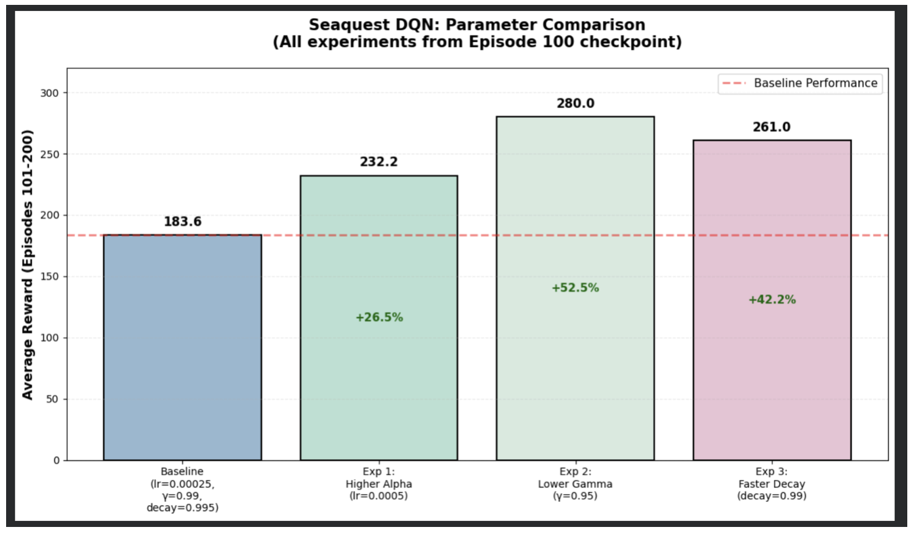

# 🎮 Seaquest Deep Q-Learning

Deep Q-Network (DQN) implementation for Atari Seaquest using PyTorch. Trained agent achieves 1,520 points (human-competitive performance) through pure reinforcement learning.

---
**Open in Google Colab:**

[](https://colab.research.google.com/drive/1cUpRaTbmSl6ko20bi2ppPIcxL8U81L_C?usp=sharing)

---

## 📊 Results

- **Best Score:** 1,520 points
- **Average Score (Final 50 episodes):** 886 points  
- **Training Episodes:** 1,000
- **Training Time:** ~2.5 hours on Tesla T4 GPU

### Performance Progression:
- Episode 100: 360 points
- Episode 400: 1,160 points
- Episode 1,000: 1,520 points

---

## 🧪 Experiments

Tested three parameter variations from Episode 100 checkpoint:

| Experiment | Parameter | Avg Reward | Improvement |
|------------|-----------|------------|-------------|
| Baseline | lr=0.00025, γ=0.99 | 183.6 | - |
| Higher Alpha | lr=0.0005 | 232.2 | +26.5% |
| Lower Gamma | γ=0.95 | 280.0 | +52.5% ⭐ |
| Faster Decay | decay=0.99 | 261.0 | +42.2% |

**Key Finding:** Lower gamma (0.95) performed best, suggesting Seaquest benefits from short-term focus due to oxygen constraints.

---

## 🎬 Demonstration

### Training Progression


### Experiment Comparison


### Agent Gameplay
*Video demonstration showing Episode 100 vs Episode 1,000 agent performance*
[Link to gameplay video](https://northeastern-my.sharepoint.com/personal/barla_g_northeastern_edu/_layouts/15/stream.aspx?id=%2Fpersonal%2Fbarla%5Fg%5Fnortheastern%5Fedu%2FDocuments%2Fseaquest%5Fcomparison%5Fimproved%20%281%29%2Emp4&referrer=Teams%2ETEAMS%2DELECTRON&referrerScenario=teamsSdk%5Fns%2Dbim)

---

## 🛠️ Technical Details

**Architecture:**
- 3 Convolutional layers (32, 64, 64 filters)
- 2 Fully connected layers (512, 18 units)
- Total parameters: 1,693,362

**Key Techniques:**
- Experience Replay (50,000 buffer)
- Target Network (updated every 2,000 steps)
- Epsilon-Greedy Exploration (1.0 → 0.01)
- Frame Stacking (4 frames for temporal info)

**Hyperparameters:**
- Learning Rate: 0.00025
- Discount Factor (γ): 0.99
- Batch Size: 16
- Epsilon Decay: 0.995

---

## 📦 Installation & Usage
```bash
# Install dependencies
pip install gymnasium[atari]
pip install gymnasium[accept-rom-license]
pip install torch numpy matplotlib opencv-python

# Run notebook
# Open in Google Colab or Jupyter and execute cells sequentially
```

**Requirements:**
- Python 3.8+
- CUDA-capable GPU (recommended)
- 12GB+ RAM

---

## 📁 Repository Structure
```
├── Seaquest_DQN_[YourName].ipynb    # Main implementation
├── seaquest_baseline_progression.png # Training graphs
├── seaquest_experiment_comparison.png # Experiment results
├── seaquest_comparison_improved.mp4   # Agent gameplay video
└── README.md                          # This file
```

---

## 🎓 Key Learnings

1. **Resource constraints matter:** Lower gamma (short-term focus) outperformed long-term planning due to oxygen mechanics
2. **Exploration timing:** Faster epsilon decay improved performance by exploiting learned strategies sooner
3. **Stability techniques:** Experience replay and target networks are critical for stable DQN training
4. **Generalization:** Neural network learned visual patterns applicable across millions of game states

---

## 📚 References

Mnih, V., et al. (2015). Human-level control through deep reinforcement learning. *Nature*, 518(7540), 529-533.

---

## 📄 License

MIT License - See implementation for full license text.

**Third-party libraries:** PyTorch (BSD), Gymnasium (MIT), ALE (GPL v2), NumPy (BSD), Matplotlib (PSF), OpenCV (Apache 2.0)

---

